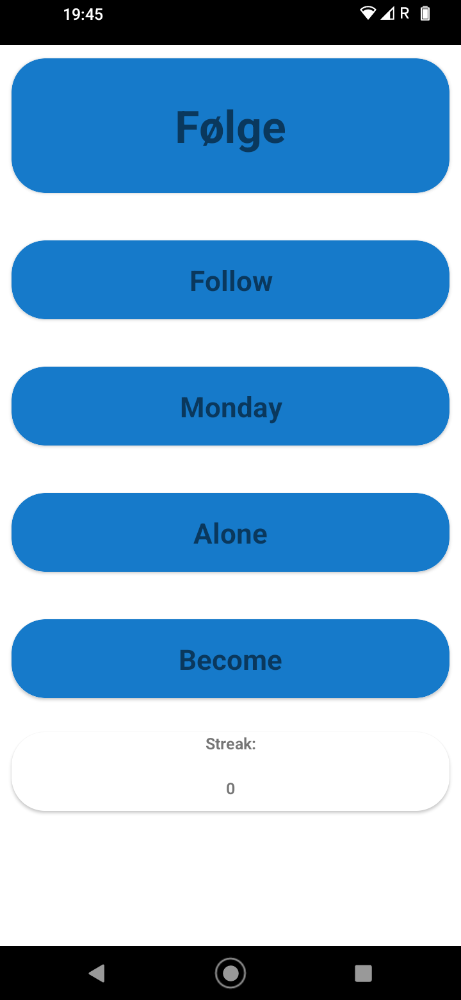
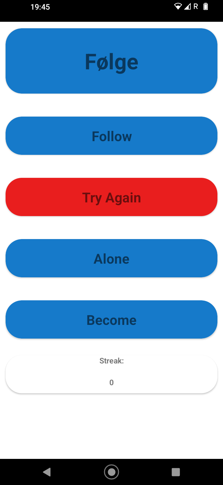
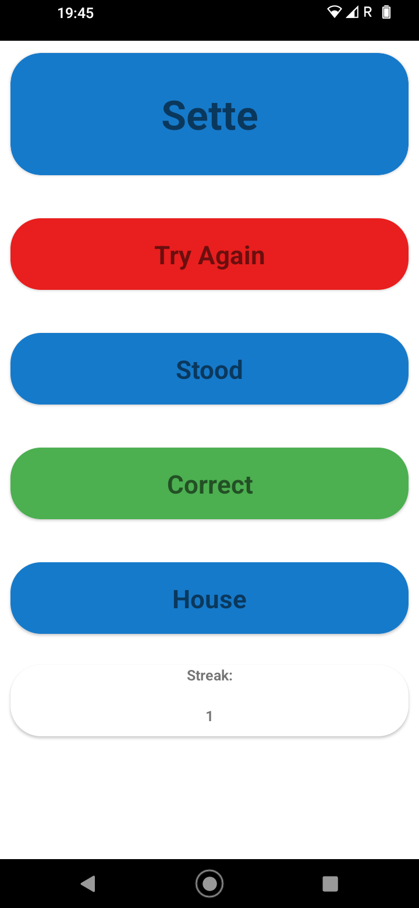

# Vocabulario_Norwegian
App to train vocabulary in the form of a basic game; the user is presented with a word (english or norwegian), and a choice of translations. When the correct translation is clicked, the game refreshes with a new word from a word library.

## Screenshots

## Download
### From Play Store
The app is currently in internal testing on google's play store, contact me on grindhaugappdev@gmail.com to be added to list of testers.

### Direct
Download the APK and use software to read it. I understand it is questionable which is why I include the internal test as an option.
